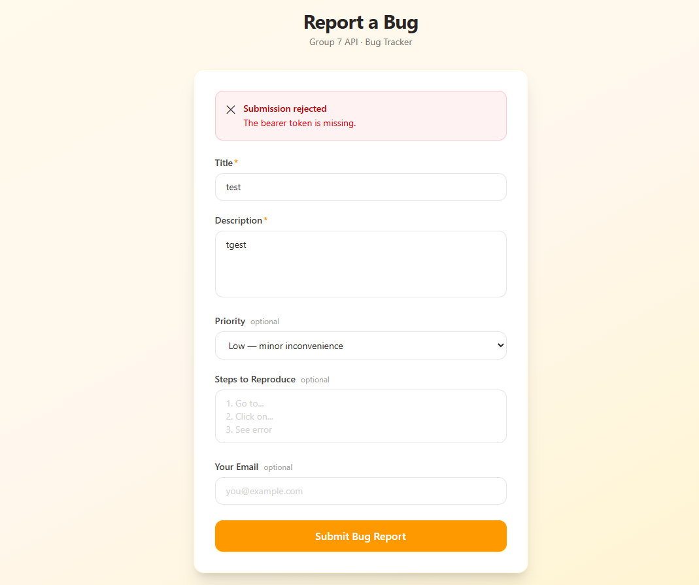
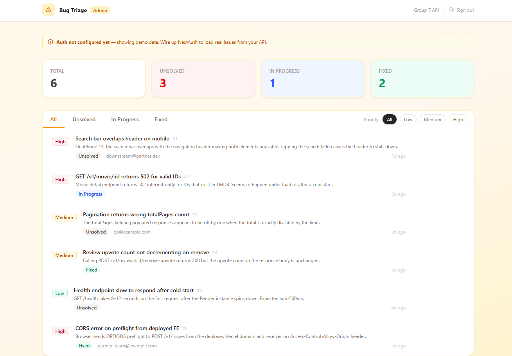

# Individual AI Workflow — Skyler Broussard

**Tool used:** Claude Code (claude-sonnet-4-6) via VS Code extension  
**Sprint:** Sprint 5 — Bug Tracker FE  
**Date:** May 2026

---

## Context Setup

Before prompting anything, I dropped two files into an empty working directory:

- `sprint-5.md` — the full sprint document
- `openapi.yaml` — our team's OpenAPI spec (Group 7)

The sprint doc explicitly said to let the context do the work rather than writing a long prompt. I opened Claude Code directly in that directory with those two files already present.

---

## Prompt 1 — Initial Scaffold

**What I said:**

> "I would like the UI to be slick and modern. Color scheme needs to be warm and inviting, not ugly. Do you need anything else to make it better before we start?"

I didn't give a long prompt describing the architecture. I let the agent read the sprint doc and spec itself and only added a style direction. I did ask if it needed anything else, which turned out to be a good move — the agent caught something I would have missed.

**What the agent produced:**

It asked two clarifying questions before writing a single line:

1. Does `POST /v1/issues` require auth? (The OpenAPI spec said yes, the sprint doc said no — a real contradiction it flagged.)
2. Vercel or Render for deployment?

I answered: auth required, embed a token; skip deployment for now.

**What was good:** The agent caught the auth contradiction between the spec and the sprint doc before building anything. That saved a broken first build.

**What missed:** My answer about auth was wrong. I said "embed a token" because the spec showed `bearerAuth`. In practice, the endpoint is meant to be public — the spec was just reflecting an implementation detail on the BE that needed to be fixed. This caused the first bug I hit.

---

## Prompt 2 — First Bug (Auth Error)

After the form was built and running at `localhost:3000`, I submitted a test bug report and got back:

> `bearer token is invalid`

**What I said:**

> "ok same issue"  
> "ok explain it. i tried to send a report bug and got bearer token is invalid... which should not be the issue. there should be no auth for report issue."

**What the agent did:**

First pass: it suggested the BE needed fixing and offered options. I pushed back — the BE was working fine, I just wanted to test the FE. The agent then correctly identified the real problem: the proxy was sending `Authorization: Bearer ` with an empty string (the placeholder token), which made the BE reject the request even though no real token was intended. It removed the auth header entirely from the proxy.

**What I kept:** The fix — no auth header on `POST /v1/issues`. The proxy now calls the BE clean.

**What I cut:** The `API_TOKEN` env var, which was unnecessary complexity once we confirmed the endpoint is public.

**What I'd do differently:** When the agent asked about auth, I should have said "no auth needed — the spec is wrong about this one." That would have saved the back-and-forth.

---

## Prompt 3 — Dashboard Extension

Once the form was working I asked for a triage dashboard. The agent immediately started installing `next-auth`, which I didn't want yet — auth provider selection wasn't decided.

**What I said:**

> "lets just make the admin dashboard similar style with all the needed styles and tabs for the admin dashboard we can do the auth later after one gets picked"

**What the agent produced:**

A full `/dashboard` page with:
- Stats bar (total / unsolved / in-progress / fixed)
- Filter tabs by status with an animated underline indicator
- Priority filter pills (All / Low / Medium / High)
- Issue list with hover-revealed actions (status dropdown + delete)
- Slide-in detail panel with full issue info and status buttons
- Delete confirmation modal
- A banner noting auth isn't wired yet

All of it used mock data so the UI was fully interactive without any real API calls.

**What was good:** The agent understood "we can do auth later" and scaffolded the whole UI with clearly marked placeholder points (the greyed-out sign-out button, the demo banner, the comment in the code pointing to where real data fetching goes). I didn't have to explain that structure — it inferred it.

**What I kept:** Everything. The dashboard matched the warm amber style of the bug form without me asking it to match — it carried the design system across on its own.

**What I cut:** Nothing from the dashboard itself. I did stop it from installing `next-auth` mid-build, which would have added auth coupling before I was ready.

---

## Summary: What I'd Do Differently

1. **Answer the auth question correctly the first time.** I said "auth required, embed a token" when I meant "this should be public, the spec is wrong." One accurate answer upfront = no debug loop.

2. **Let the agent finish before redirecting.** When it started installing next-auth, I interrupted. That was the right call, but I could have seen it coming — I should have said upfront "build the UI only, no auth libraries yet."

3. **Context did most of the work.** The two files in the directory (sprint doc + OpenAPI spec) meant I never had to explain what POST /v1/issues does, what fields the form needs, what the status enum values are, or how the API is structured. The agent read all of that. My actual prompts were short and mostly directional.

4. **The style prompt was worth it.** "Warm and inviting, not ugly" was vague but it worked. The agent picked an amber/stone palette, rounded corners, warm gradients — I didn't have to specify any of that. Giving a direction rather than a specification is a legitimate prompt strategy.

---

## What the Agent Built (Final State)

| File | What it does |
|---|---|
| `app/page.tsx` | Public bug report form with all three states (success, validation error, network error) |
| `app/api/issues/route.ts` | Server-side proxy — keeps the BE URL server-side, never in the browser |
| `app/dashboard/page.tsx` | Admin triage dashboard with mock data, filters, detail panel, delete confirmation |
| `app/layout.tsx` | Root layout with metadata and Geist font |
| `app/globals.css` | Warm amber/stone CSS variables |
| `.env.local` | `API_BASE_URL` env var (gitignored) |

